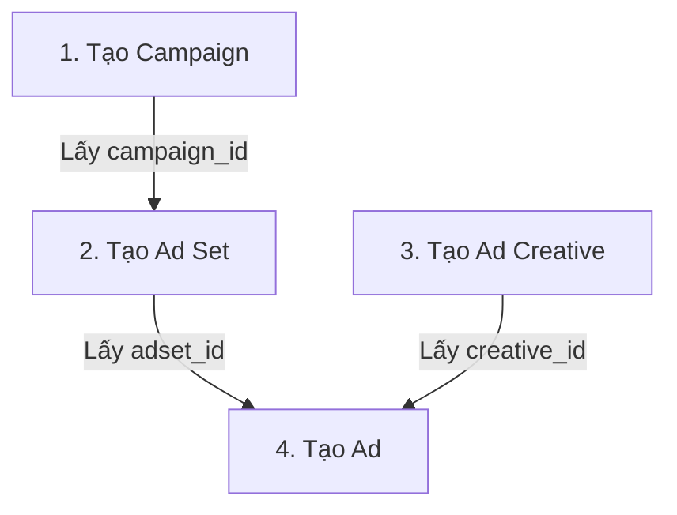

# Lên chiến dịch quảng cáo Facebook Ads

Skill này hướng dẫn Agent cách chuẩn bị cấu trúc, tạo payloads và thực thi các API gọi tới Facebook Marketing API để lên một chiến dịch quảng cáo đầy đủ bao gồm: **Campaign**, **Ad Set**, **Ad Creative**, và **Ad**.

## 1. Yêu cầu chuẩn bị (Prerequisites)

Trước khi thực hiện bất kỳ lệnh gọi API nào, hãy đảm bảo các thông tin sau đã được khai báo đầy đủ (thường nằm trong file `.env` hoặc cấu hình dự án):

- **`FB_ACCESS_TOKEN`**: Token truy cập Facebook có quyền `ads_management` và `pages_read_engagement` (hoặc Page Access Token tương ứng).
- **`FB_AD_ACCOUNT_ID`**: ID tài khoản quảng cáo của bạn (định dạng `act_123456789`).
- **`FB_PAGE_ID`**: ID Trang Facebook sẽ dùng để chạy quảng cáo (bắt buộc khi tạo Ad Creative).

---

## 2. Quy trình 4 bước lên chiến dịch

Một cấu trúc quảng cáo Facebook chuẩn bao gồm 4 đối tượng được tạo tuần tự:



### Bước 1: Tạo Campaign (Chiến dịch)
Xác định mục tiêu chính của chiến dịch (ví dụ: `OUTCOME_LEADS`, `OUTCOME_TRAFFIC`, `OUTCOME_ENGAGEMENT`).

- **Endpoint**: `POST https://graph.facebook.com/v20.0/act_<AD_ACCOUNT_ID>/campaigns`
- **Payload tối thiểu**:
  ```json
  {
    "name": "CXK_BS Định_2026-06-19_Leads",
    "objective": "OUTCOME_LEADS",
    "status": "PAUSED",
    "special_ad_categories": "[]"
  }
  ```

### Bước 2: Tạo Ad Set (Nhóm quảng cáo)
Thiết lập ngân sách, thời gian chạy, đối tượng mục tiêu (targeting) và vị trí quảng cáo.

- **Endpoint**: `POST https://graph.facebook.com/v20.0/act_<AD_ACCOUNT_ID>/adsets`
- **Payload tối thiểu**:
  ```json
  {
    "name": "AdSet_CXK_BS Định_Target_Hanoi",
    "campaign_id": "<CAMPAIGN_ID>",
    "daily_budget": "100000", 
    "billing_event": "IMPRESSIONS",
    "optimization_goal": "LEADS",
    "bid_strategy": "LOWEST_COST_WITHOUT_CAP",
    "targeting": "{\"geo_locations\": {\"countries\": [\"VN\"], \"regions\": [{\"key\": \"3840\"}]}}", 
    "status": "PAUSED"
  }
  ```
  *(Lưu ý: Ngân sách `daily_budget` được tính bằng đơn vị tiền tệ nhỏ nhất của tài khoản. Ví dụ VND thì là VNĐ, nhưng nếu tài khoản USD thì 100000 tương đương 1000 USD, cần chú ý cấu hình).*

### Bước 3: Tạo Ad Creative (Mẫu thiết kế quảng cáo)
Định nghĩa nội dung quảng cáo sẽ hiển thị bao gồm: hình ảnh, video, tiêu đề, mô tả và liên kết hoặc ID bài viết có sẵn.

- **Endpoint**: `POST https://graph.facebook.com/v20.0/act_<AD_ACCOUNT_ID>/adcreatives`
- **Payload (Sử dụng bài viết có sẵn - Page Post)**:
  ```json
  {
    "name": "Creative_CXK_BS Định_Post1",
    "object_story_id": "<PAGE_ID>_<POST_ID>"
  }
  ```
- **Payload (Tạo mẫu mới với liên kết hình ảnh)**:
  ```json
  {
    "name": "Creative_New_Link_Ad",
    "object_story_spec": {
      "page_id": "<PAGE_ID>",
      "link_data": {
        "image_hash": "<IMAGE_HASH>",
        "link": "https://vietlife.edu.vn",
        "message": "Nội dung bài viết quảng cáo ở đây...",
        "call_to_action": {
          "type": "LEARN_MORE",
          "value": {
            "link": "https://vietlife.edu.vn"
          }
        }
      }
    }
  }
  ```

### Bước 4: Tạo Ad (Quảng cáo)
Liên kết Nhóm quảng cáo (Ad Set) với Mẫu quảng cáo (Ad Creative) để kích hoạt quảng cáo thực tế.

- **Endpoint**: `POST https://graph.facebook.com/v20.0/act_<AD_ACCOUNT_ID>/ads`
- **Payload tối thiểu**:
  ```json
  {
    "name": "Ad_CXK_BS Định_Mẫu 1",
    "adset_id": "<ADSET_ID>",
    "creative": "{\"creative_id\": \"<CREATIVE_ID>\"}",
    "status": "PAUSED"
  }
  ```

---

## 3. Các lỗi thường gặp và cách xử lý

1. **Lỗi Token hết hạn hoặc thiếu quyền (Error Code 190 / 200)**:
   - *Triệu chứng*: Response trả về `Invalid OAuth access token` hoặc `Permissions error`.
   - *Giải pháp*: Kiểm tra biến `FB_ACCESS_TOKEN` trong file `.env`. Sử dụng Facebook Access Token Tool để debug và gia hạn token.
2. **Lỗi Ngân sách quá thấp (Error Code 100 / Subcode 1885016)**:
   - *Triệu chứng*: Ngân sách thấp hơn mức tối thiểu Facebook quy định cho loại tiền tệ đang dùng.
   - *Giải pháp*: Tăng `daily_budget` tối thiểu lên (ví dụ: tối thiểu khoảng 25.000 VNĐ cho tài khoản VND).
3. **Lỗi Target không hợp lệ (Error Code 100 - Invalid Targeting Spec)**:
   - *Triệu chứng*: Dữ liệu targeting JSON truyền lên bị sai cú pháp.
   - *Giải pháp*: Sử dụng đúng cấu trúc định dạng JSON string cho tham số `"targeting"`.

---

## 4. Helper Script hỗ trợ tạo tự động

Người dùng có thể sử dụng helper script [fb_creation_helper.py](file:///Users/daudau/.gemini/antigravity/worktrees/VL/create-skill-facebook-ads/.agents/skills/facebook-ads-campaign/scripts/fb_creation_helper.py) để thực hiện tự động cả 4 bước trên chỉ bằng một lệnh gọi hàm Python hoặc qua terminal.
