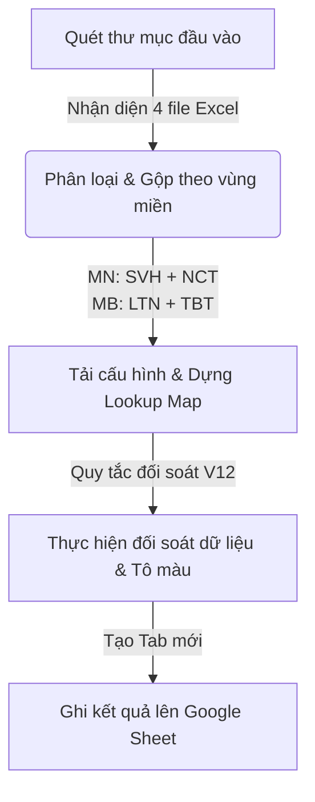

# Đối soát dữ liệu Bệnh viện Vietlife (Reconciliation V12)

Skill này giúp tự động hóa quy trình gom các file báo cáo định kỳ dạng Excel theo vùng miền, áp dụng các quy tắc nghiệp vụ đối soát V12 (tái khám, bảo vệ nguồn, ưu tiên điền bác sĩ chỉ định) và ghi đè kết quả đã xử lý (kèm tô màu trực quan) lên Google Sheets.

## 1. Nguyên lý hoạt động

Quy trình tự động hóa diễn ra qua 3 bước chính:



### Tiêu chí phân nhóm
- **Miền Nam (MN)**: Gộp dữ liệu từ 2 file **SVH** và **NCT**.
- **Miền Bắc (MB)**: Gộp dữ liệu từ 2 file **LTN** và **TBT**.
- **Khoảng thời gian (Timeframe)**: Tự động trích xuất từ tên file hoặc tên thư mục (ví dụ: `13-19Jun` trong file `SVH_13-19Jun.xlsx`).

---

## 2. Quy tắc đối soát V12 áp dụng

Script đối soát sẽ duyệt qua từng dòng dữ liệu và áp dụng chính xác các logic nghiệp vụ sau:

1. **Chuẩn hóa Số điện thoại & Bác sĩ**:
   - SĐT được rút gọn về 9 chữ số cuối.
   - Bác sĩ được đối chiếu với danh sách 31 bác sĩ chuẩn của Vietlife.
2. **Quy tắc Tái khám**:
   - Xác định là tái khám nếu `Ngày khám (Cột B)` khác `Ngày so sánh (Cột V)` (và cả hai không rỗng) hoặc `Nguồn (Cột W)` bắt đầu bằng `"tái khám -"`.
   - Các dòng tái khám được đánh dấu tô màu xám nhạt (`#D3D3D3`) toàn dòng.
3. **Quyền cập nhật & Bảo vệ nguồn**:
   - Ca tái khám không được cập nhật trừ khi có dịch vụ đặc biệt: `"cắt dây chằng"` hoặc `"ngón tay"`.
   - Nếu nguồn thuộc nhóm `"Bs hợp tác..."` hoặc `"Khách hàng/Bạn bè"`, chỉ cho phép cập nhật nếu bác sĩ thuộc danh sách ngoại lệ được phép (`Đinh Trọng Tuyên`, `Kiều Đình Hùng`, `Đỗ Vũ Anh`).
4. **Đối soát Lookup Map**:
   - Thực hiện tra cứu SĐT với Lookup Map (được tải từ các sheet cấu hình trong bảng tính).
   - Nếu tìm thấy và thỏa mãn điều kiện cập nhật, sẽ ghi nhận `finalSource` (ô tương ứng tô màu vàng `#FFFF00`) và `finalDoctor` (các ô AC, AD, AE tô màu vàng `#FFFF00`).

---

## 3. Hướng dẫn thực thi

### Yêu cầu chuẩn bị (Prerequisites)
Để tương tác được với Google Sheets API, bạn cần xác thực bằng một trong các phương thức sau:
1. **gcloud CLI (Khuyên dùng khi chạy local)**:
   Mở terminal và chạy lệnh sau để xác thực:
   ```bash
   gcloud auth application-default login
   ```
2. **Service Account JSON**:
   Nếu chạy tự động hoặc không có gcloud CLI, hãy chuẩn bị file JSON key của Service Account có quyền chỉnh sửa bảng tính mục tiêu.

### Cú pháp dòng lệnh
Chạy file script bằng Python để thực hiện đối soát:

```bash
python .agents/skills/hospital-reconciliation/scripts/reconcile.py <PATH_TO_FOLDER> [OPTIONS]
```

**Các tham số:**
- `<PATH_TO_FOLDER>`: Đường dẫn tuyệt đối hoặc tương đối tới thư mục chứa các file Excel nguồn (`SVH`, `NCT`, `LTN`, `TBT`).
- `--spreadsheet-id`: ID của bảng tính Google Sheet mục tiêu (Mặc định: `1BIMzw4aUhrvOFbKZsj3s4Zu6n2qb_MFI9qakt9DDsec`).
- `--credentials`: Đường dẫn tới file Service Account JSON (nếu dùng xác thực qua key file).
- `--timeframe`: Ép buộc khoảng thời gian chỉ định (ví dụ: `13-19Jun`) nếu không muốn hệ thống tự động nhận diện từ tên file.

### Ví dụ thực thi:
```bash
python .agents/skills/hospital-reconciliation/scripts/reconcile.py "C:\Users\Anh Tu\Documents\Data_13-19Jun" --timeframe "13-19Jun"
```

Sau khi chạy xong, kết quả sẽ được tạo thành các tab mới trên Google Sheet như: `MB 13-19 Jun` và `MN 13-19 Jun`.

---

## 4. Cơ chế Cột mở rộng (AH-AP)

Cột mở rộng được dùng để đối chiếu trực tiếp hiệu quả của Marketing chéo với dữ liệu bệnh viện:

1. **Check SĐT Bệnh nhân với Marketing Leads**:
   - Script tự động lấy danh sách Số điện thoại thực tế đến khám (cột F) của tuần đó.
   - Tra cứu (check) các số này ngược với **tất cả 9 bảng tính cấu hình Marketing** trong file Google Sheet: `Data chung`, `Trung tâm cột sống 2026`, `Trung tâm CXK 2026`, `Trung tâm Thần kinh 2026`, `Data 2024`, `Data T1-T2`, `Thầy`, `Web`, `CĐ`.
   - Nếu số điện thoại nào trùng khớp (bệnh nhân đến khám do Marketing mang về), script sẽ ghi nhận vào cột AH-AJ:
     - **Cột AH**: Số điện thoại (dạng chuẩn hóa 9 chữ số cuối)
     - **Cột AI**: Kênh Marketing (ví dụ: Facebook, Tiktok, App...)
     - **Cột AJ**: Bác sĩ Marketing chỉ định/Kênh cụ thể
2. **Công thức Đối chiếu Tự động (Google Sheets)**:
   Các cột từ AK đến AP được điền sẵn công thức kéo xuống hết số lượng leads trùng khớp để thực hiện đối soát tự động:
   - **Cột AK (Nguồn micom)**: `=vlookup(AH2;F:AD;18;0)` (Lấy nguồn khách hàng ghi nhận trên hệ thống bệnh viện ở cột W).
   - **Cột AL (BS bổ sung)**: `=vlookup(AH2;F:AD;25;0)` (Lấy bác sĩ bổ sung ở cột AD).
   - **Cột AM (Tổng số xuất hiện)**: `=countif(F:F;AH2)` (Đếm số lần SĐT xuất hiện trong danh sách đến khám).
   - **Cột AN**: `=countifs(F:F;AH2;W:W;AK2)`
   - **Cột AO**: `=countifs(F:F;AH2;AD:AD;AL2)`
   - **Cột AP (Trạng thái check)**: `=if(AM2<>AO2;"check";"")` (Tự động đưa ra cảnh báo `"check"` nếu có sự sai lệch thông tin).
